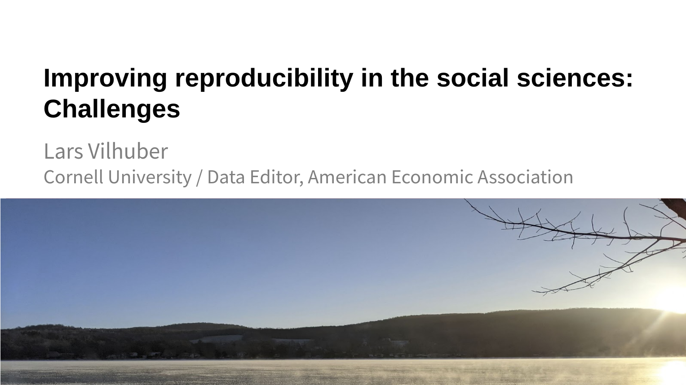

#  Presentation: Improving reproducibility in the social sciences: Challenges

Presented as part of [RDA17](https://www.rd-alliance.org/rdas-17th-plenary-meeting-programme) in the session on "[Experiments in Preparing Data for Interchange and Openness](https://www.rd-alliance.org/plenaries/rda-17th-plenary-meeting-edinburgh-virtual/experiments-preparing-data-interchange-and)", organized by the [IG RDARI](https://www.rd-alliance.org/groups/research-data-architectures-research-institutions-ig).

- Online location: [Google Drive](https://docs.google.com/presentation/d/1OeL6nDAJ1XzvX8UJCIFo6Ks7a8aS9skoccDDe2lziEY/edit?usp=sharing)
- Local: [PDF](presentation-vilhuber-20210420.pdf), [PPTX](presentation-vilhuber-20210420.pptx)
- Archived: [https://doi.org/10.5281/zenodo.4705216](https://doi.org/10.5281/zenodo.4705216)
